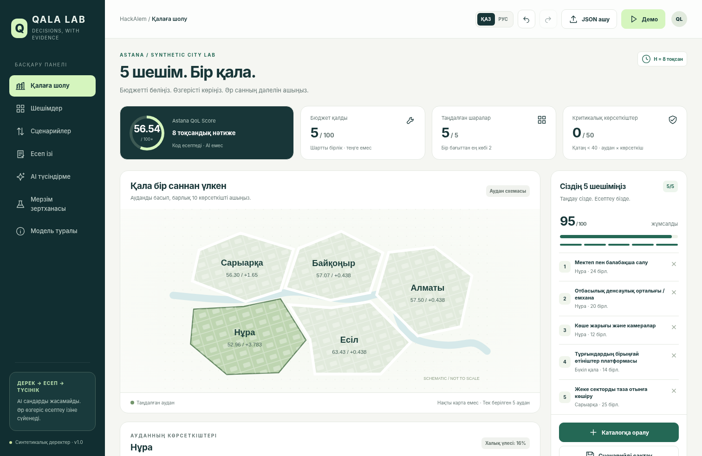

# QALA LAB
## 5 шешім. Әр санға дәлел.

«5 сағатқа әкім» HackAlem тапсырмасына арналған жұмыс істейтін, дереккөзге сүйенген қалалық сценарийлер симуляторы. Қолданушы бес шараны өзі таңдайды; код ережелерді тексеріп, ұйымдастырушының формуласы бойынша есептейді; қосымша AI қабаты тек сол есептегі дәлелдерді таңдап түсіндіреді.

**Бұл — синтетикалық модель. Нақты Астанаға баға, нақты бюджет ұсынысы немесе болашақ болжамы емес.** Жоба қай саясатты таңдау керегін шешпейді, сценарийлерді рейтингтемейді және нақты тұрғындардың пікірін ойдан шығармайды.

Жылдам бастау: [START_HERE_KK.md](START_HERE_KK.md).



## Іске қосу

Python 3.11+ және заманауи браузер жеткілікті. Негізгі қолданбаға үшінші тарап пакеттері, Node.js, сыртқы шрифттер, CDN немесе дерекқор қажет емес.

```bash
python server.py --open
# Browser: http://127.0.0.1:8000
```

Windows: `START_WINDOWS.bat`. macOS/Linux: `sh start.sh`.
`python` орнына Windows-та `py -3`, macOS/Linux-та `python3` қолдануға болады.
Сервер терминалын ашық қалдырыңыз. Тоқтату — `Ctrl+C`.

Тесттер:

```bash
python -m unittest discover -s tests -v
```

Локалды Docker нұсқасы, қосымша мүмкіндік:

```bash
docker build -t qala-lab .
docker run --rm -p 127.0.0.1:8000:8000 qala-lab
# With a configured server-side API key:
docker run --rm -p 127.0.0.1:8000:8000 --env-file .env qala-lab
```

Dockerfile дайындалды, бірақ осы жинақты жасаған ортада Docker build/run орындалған жоқ. Бұл HTTP сервері қоғамдық production үшін арналмаған.

## Не іске асырылды?

| Мүмкіндік | Қайда қарау керек |
|---|---|
| 14 шара, 5 аудан, 10 көрсеткіш | «Шешімдер», «Қалаға шолу», `app/dataset.json` |
| Бюджет, дәл бес шара, қайталанбау, аудан және үйлесім ережелері | `app/engine.py::validate`, HTTP 422 |
| Толық лаг, синергия, clip, салмақтар және Score формуласы | `app/engine.py::simulate` |
| Барлық 50 ұяшықтың before → terms → after журналы | «Есеп ізі», көрсеткішті басу |
| Екі сценарийдің бейтарап B−A айырмасы | «Сценарийлер» |
| Деректер мен код нұсқасына байланған SHA-256 паспорт | JSON экспорт/импорт |
| Шараны кешіктіру тәжірибесі, ресми есептен бөлек | «Мерзім зертханасы» |
| Қазақша/орысша интерфейс | ҚАЗ / РУС ауыстырғышы |
| Енгізуді болдырмау/қайталау | Жоғарғы панельдегі екі көрсеткі |
| Браузерде 8 сценарийге дейін сақтау | «Сценарийлер»; `localStorage` |
| JSON, CSV, басып шығарылатын PDF есебі | «Паспорт», «CSV», принтер белгісі |
| Бес қадамдық қорғау нұсқаулығы | «Демо» |
| OpenAI Responses API интеграциясы, дәлел ID валидациясы | `app/ai.py` |
| Кілтсіз детерминдік түсіндірме | «ЖЕРГІЛІКТІ ШАБЛОН» белгісі; LLM емес |

## Дереккөз және ережелер

Түпнұсқалар өзгертілмей сақталған:

- `sources/dataset.docx` — пайдаланушы берген «Датасет районов.docx».
- `sources/brief.pdf` — пайдаланушы берген HackAlem тапсырмасы.
- `sources/SHA256SUMS.txt` — түпнұсқа файлдардың бақылау сомалары.

`app/dataset.json` кестелері DOCX файлынан бағдарламалық түрде көшірілген. Қазақша атаулар интерфейс үшін қосылған; ID, орысша түпнұсқа атаулар және сандық параметрлер сақталған. `SourceTests` бастапқы Word XML кестелерімен салыстырып тексереді.

Құжаттағы жалпы сипаттама бес бағытты атайды. Қолданба нақты тексеру үшін датасеттің §4 бөліміндегі егжей-тегжейлі ережені қолданады: **дәл 5 шара, бір бағыттан ең көбі 2**. Бес бағыттың әрқайсысынан бір шара алу міндетті емес. Бұл таңдау README-де және интерфейсте ашық көрсетілген.

| Түпнұсқа бөлімі | Іске асырылуы |
|---|---|
| Датасет §1: аудандар, халық үлестері, 10 көрсеткіш | `dataset.json:districts,metrics` |
| Датасет §2: 14 шара, құн, лаг, әсер | `dataset.json:measures`; `_compute` |
| Датасет §2: 3 синергия | `dataset.json:synergies`; өзгермейтін бонус |
| Датасет §2: үйлеспейтін жұптар | `dataset.json:incompatibilities`; `validate` |
| Датасет §3: формула, салмақтар, <40 шегі | `simulate`, `_compute` |
| Датасет §4: жарамдылық ережелері | `validate` |
| Тапсырма PDF, 1–2-беттер: негізгі сценарий және түсіндірме | Интерфейс, есептеу, AI дәлел қабаты |
| Тапсырма PDF, 3-бет: README және қайта тексеру | Бұл README, тесттер, паспорт, қорғау материалдары |

## Есептеу

```text
H = 8 тоқсан
Әсер үлесі = (8 − lag) / 8
I′ = clip(I + Σ толық_әсер × әсер_үлесі + синергия, 0, 100)
D = Σ weight × I′
D_avg = Σ population_share × D
Score = 0.7 × D_avg + 0.3 × min(D) − N_crit
N_crit = барлық аудан × көрсеткіш жұптарының ішінде I′ < 40 болатындарының саны
```

Салмақтар: T1 0.10, T2 0.10, E1 0.09, E2 0.11, S1 0.11, S2 0.11, B1 0.09, B2 0.09, C1 0.10, C2 0.10. Қосындысы — 1.

Әр шара бір рет қана таңдалады. Қалалық шара барлық бес ауданға әсер етеді; аудандық шара тек бір көрсетілген ауданға әсер етеді. Қалалық шарада `district_id` кілті мүлде болмауы керек, `null` да қабылданбайды.

Синергиялар лагпен азайтылмайды. Барлық әсерлер қосылғаннан кейін ғана әр көрсеткіш 0–100 аралығына шектеледі. **Score-дың өзін 0–100 аралығына қосымша шектеу түпнұсқада жоқ және кодта қосылмаған.**

Барлық есептеу `Decimal` арқылы жүреді. API-ге шығару кезінде мәндер JSON сандарына айналады, ал `exact_score` және ұяшықтардың `exact_after` өрістерінде толық ондық жазылым сақталады. Интерфейстегі қысқа дөңгелектеу кейінгі есепке қайта берілмейді.

Толық емес жиынтыққа Score берілмейді. `/api/validate` ішіндегі `complete:false` тек редактордағы аралық тексеруге арналған; ол есептеу құқығын бермейді. `/api/simulate` үнемі толық бес шешімді тексереді. Бастапқы күй экранда «сценарий әлі жоқ» деп бөлек белгіленген.

## AI: нақты міндеті мен шектеуі

```text
Қолданушының 5 шешімі
    → Серверлік валидация
    → Decimal есептеу модулі
    → Тексерілген фактілер каталогы
    → LLM сұраққа қатысты fact_id тізімін таңдайды
    → Құрылым мен fact_id қайта тексеріледі
    → Сервер тиісті сөйлемдер мен сандарды шығарады
```

Бұл — еркін мәтін жазатын қала кеңесшісі емес, **дәлелдерге байланған түсіндірме құрастырушы**. LLM-дегі сандарға арналған еркін өріс жоқ. Ол `heading` пен `fact_ids` ғана қайтарады. Танылмаған ID немесе қосымша мәтін қабылданбайды. Қажетті модель шектеулері және таңдалған M11 шарасының екі жақты әсері түсіндірмеден алынып тасталмайды.

Бұл тексеру деректердің қайдан шыққанын қамтамасыз етеді, бірақ LLM дәлелдерді әрдайым орынды немесе толық таңдайтынына кепіл емес. Семантикалық орындығын адам тексеруі керек. «Галлюцинация мүлде болмайды» деген жалпы мәлімдеме жасалмайды.

Кілтсіз режим — қарапайым кілт-сөз ережелері мен сол есеп фактілерінен құрастырылған шаблон. Ол тілдік модель емес және интерфейс оны жасырмайды. Модельдер тізбегін немесе кәдімгі валидаторларды «көп агентті жүйе» деп атамаймыз.

API қосу:

```dotenv
# .env файлында; браузерде емес
OPENAI_API_KEY=your_key_here
OPENAI_MODEL=gpt-4.1-mini
```

Серверді қайта іске қосыңыз. OpenAI Responses endpoint, `text.format` ішіндегі strict JSON Schema және `store:false` қолданылады. Әр сұрау тек сценарий фактілерін және пайдаланушының сұрағын жібереді. Шығын мен деректерді пайдалану шарттарын өз API аккаунтыңыздан тексеріңіз. Құпия немесе дербес деректерді сұраққа енгізбеңіз.

Нақты OpenAI байланысы осы жинақты дайындағанда тексерілген жоқ: кілт берілмеген. Mock-тесттер HTTP сұрау құрылымын, дұрыс жауапты, 401 қатесін, timeout, refusal және белгісіз дәлел ID-ларын тексереді.

## Айырмашылық беретін қосымша мүмкіндіктер

### 1. Әр ұяшыққа арналған есеп ізі

Қорытынды саннан нақты ауданға, көрсеткішке және әсер еткен шараға дейін баруға болады. Әр жазбада бастапқы мән, толық әсер, лаг, іске асқан әсер, синергия, шектеу түзетуі, соңғы мән және салмақ бар. CSV/JSON экспортында толық 50 ұяшық сақталады.

### 2. Қайта есептелетін паспорт

ID мына кірістердің SHA-256 хэші: канондық реттелген шешімдер, нормаланған датасет хэші, есептеу модулінің файл хэші және нұсқасы. Шешім реті нәтижеге әсер етпейді. Код немесе дерек өзгерсе, ID өзгереді.

Бұл цифрлық қолтаңба, өзгермейтін тізбек немесе авторлықты растау механизмі емес. Бірдей кіріс пен кодты қайта тексеруге арналған fingerprint. Импортталған файлдағы дайын Score-ға сенілмейді: сервер тек шешімдерді алып қайта есептейді.

### 3. Болжамға арналған бөлек зертхана

«Мерзім зертханасы» — түпнұсқада жоқ, команда қосқан тәжірибе. Бір таңдалған шараға 0–3 тоқсан кідіріс қосылады. Барлық қалған параметрлер мен синергия бонустары тұрақты қалады. Тек көрсеткіш айырмалары көрсетіледі; жаңа Score немесе ықтималдық жасалмайды. Ресми сценарий мен оның паспорт ID-сы өзгермейді.

## Тексеру мысалы

Ұйымдастырушының мысалы `examples/organizer_example.json` ішінде. Ол «ең дұрыс таңдау» ретінде ұсынылмайды. Тексеру: бес шара, құны 95, мектеп/емхана/жарық Нұрада, таза отын Сарыарқада, өтініштер платформасы бүкіл қалада. Мектептің S1 толық әсері +16, лагы 3; іске асқан әсері +10. `ArithmeticTests` түпнұсқа мысалды және формуланы тексереді.

Тест орындалуының нақты есебі: [docs/TEST_REPORT.md](docs/TEST_REPORT.md).
Бақылау нәтижесінің JSON көшірмесі: `examples/reference_output.json`. Импортта бәрібір қайта есептеледі.

## API

| Әдіс / жол | Не істейді |
|---|---|
| GET `/api/health` | Нұсқа, сервер және кілт конфигурациясы; кілт мәнін бермейді |
| GET `/api/bootstrap` | Датасет және бөлек белгіленген бастапқы күй |
| POST `/api/validate` | `{decisions, complete}`; Score есептемейді |
| POST `/api/simulate` | `{decisions}`; толық сценарий, журнал және паспорт |
| POST `/api/compare` | `{a, b}`; екі толық жарамды сценарийдің B−A айырмасы |
| POST `/api/evidence` | `{decisions}`; есептен жасалған дәлелдер каталогы |
| POST `/api/explain` | `{decisions, question, lang}`; `llm` немесе `offline` режимі |
| POST `/api/sensitivity` | `{decisions, measure_id, extra_lag}`; бөлек тәжірибе |

```json
{
  "decisions": [
    {"measure_id":"M7","district_id":"nura"},
    {"measure_id":"M8","district_id":"nura"},
    {"measure_id":"M10","district_id":"nura"},
    {"measure_id":"M12"},
    {"measure_id":"M5","district_id":"saryarka"}
  ]
}
```

Қате жиынтық: HTTP 422, себептер тізімі, `score:null`. Қате JSON/түр: 400. Шамадан тыс сұрау денесі: 413. Басқа origin: 403. Түсіндірмелерді жергілікті шектеу: минутына жалпы 8 сұрау, асып кетсе 429. Сұрау денесі 64 КБ-тан аспайды.

## Қауіпсіздік және сақталатын ақпарат

Кілт тек серверде; `.env` статикалық файл ретінде берілмейді. Статикалық маршруттар whitelist-пен шектелген. UI енгізулерді HTML ретінде орындамайды. Сыртқы origin қабылданбайды; әдепкі сервер тек `127.0.0.1` мекенжайын тыңдайды. HTTP-ке no-sniff, CSP, no-referrer және frame-deny тақырыптары қойылған.

Сценарийлер осы браузердің `localStorage` ішінде сақталады, орталық аккаунт/дерекқор жоқ. Құрылғыны ауыстыру үшін JSON файл қажет. «Сілтемені көшіру» сол серверге арналған URL береді; `localhost` сілтемесі басқа адамның компьютерімен ортақ сервер жасамайды.

`http.server` қоғамдық production үшін ұсынылмайды. Auth, рөлдер, TLS, тұрақты сақтау, өндірістік сервер, орталық rate limiting және кәсіби security review осы прототиптің дайын мүмкіндіктері емес. Деректердің шынайылығы немесе нақты басқару шешімінің тиімділігі тестпен дәлелденді деп мәлімдемейміз.

## Қорғау және репозиторий

- [3 минуттық демо мәтіні](docs/DEMO_KK.md)
- [Қорғау сұрақтары мен жауаптары](docs/DEFENSE_KK.md)
- [Архитектура](docs/ARCHITECTURE.md)
- [Бағалау талаптарына сәйкестік](docs/RUBRIC_MAP.md)
- [Тесттердің нақты есебі](docs/TEST_REPORT.md)
- [Презентация](docs/QALA_LAB_Pitch_KK.pptx)

GitHub Actions workflow `.github/workflows/test.yml` ішінде дайын. Оның CI орындалуы бұл жинақты дайындағанда іске қосылмады; локалды тест нәтижесін CI нәтижесі деп көрсетпеңіз. Репозиторий ашып, файлдарды жүктеу кезінде `.env` қоспаңыз. Түпнұсқа ұйымдастырушы материалдарының жариялау лицензиясы берілген файлдарда көрсетілмеген; оларды ашық репозиторийге қоспас бұрын жариялау шарттарын нақтылаңыз.

## Техникалық сыртқы дереккөздер

Бұл сілтемелер симуляция параметрлерін өзгертпейді; тек іске асыру тәсіліне қатысты ресми құжаттама. Қаралған күні: 2026-09-23.

- Python Decimal: https://docs.python.org/3/library/decimal.html
- Python HTTP server және production шектеуі: https://docs.python.org/3/library/http.server.html
- OpenAI Structured Outputs: https://developers.openai.com/api/docs/guides/structured-outputs
- GPT-4.1 mini құжаттамасы: https://developers.openai.com/api/docs/models/gpt-4.1-mini
- GitHub Actions checkout: https://github.com/actions/checkout
- GitHub Actions setup-python: https://github.com/actions/setup-python
